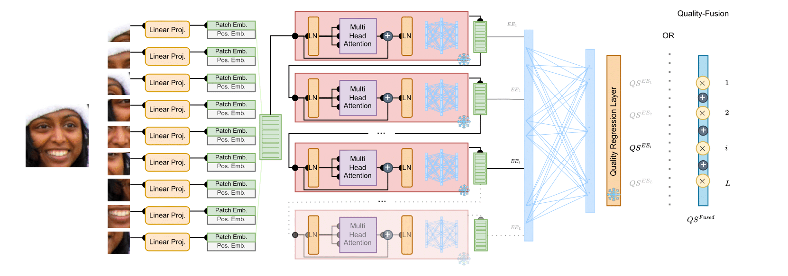
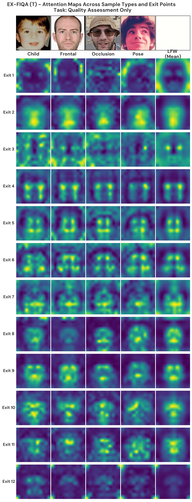
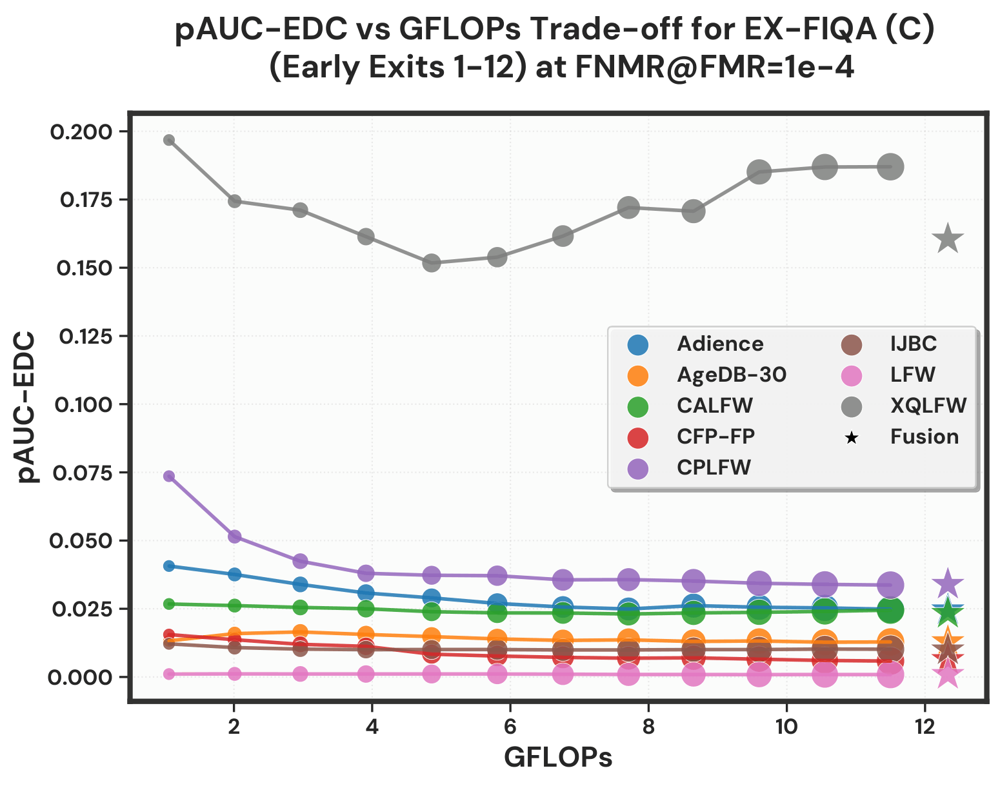
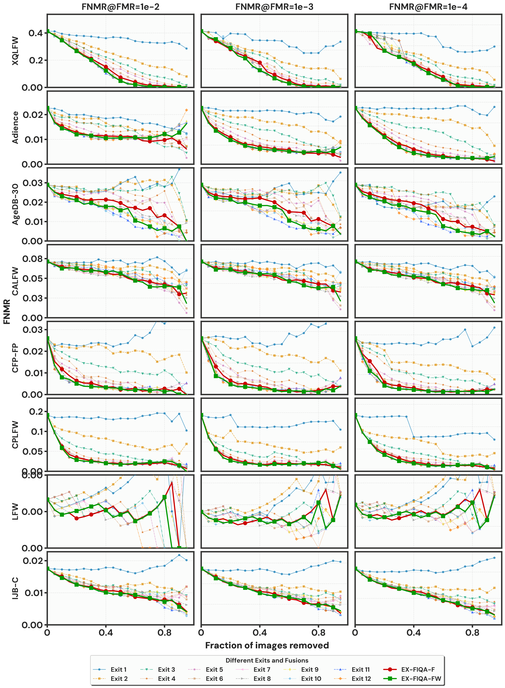

# EX-FIQA: Leveraging Intermediate Early eXit Representations from Vision Transformers for Face Image Quality Assessment

This repository contains the official implementation of the paper **"[EX-FIQA: Leveraging Intermediate Early eXit Representations from Vision Transformers for Face Image Quality Assessment](https://arxiv.org/pdf/2604.22842)"**, accepted at FG2026.

## Overview

**EX-FIQA** is a face image quality assessment method that leverages intermediate representations from Vision Transformer (ViT) models. Unlike traditional approaches that rely solely on final layer outputs, our method extracts quality-aware features from all 12 transformer blocks of ViT-S, enabling both early exit capabilities and comprehensive quality assessment through feature fusion.

We utilize two pre-trained model variants from [ViT-FIQA](https://github.com/atzoriandrea/ViT-FIQA-Assessing-Face-Image-Quality-using-Vision-Transformers):
- **ViT-FIQA (C)**: Model trained jointly for quality assessment and face recognition tasks
- **ViT-FIQA (T)**: Model trained exclusively for quality assessment in addition to the face recognition task

We investigate the intermediate representations of these two pretrained models:
- **Individual Exit Quality Scores**: Quality assessment at each transformer block (Exit 1-12)
- **EX-FIQA-F**: Fusion strategy combining predictions from all exits (mean aggregation)
- **EX-FIQA-FW**: Weighted fusion strategy optimizing exit contribution weights

### Key Features

- **Ready-to-Use Pre-trained Models**: No training required, and can be expanded other ViT-based FIQA models
- **Multi-Exit Architecture**: Extracts quality predictions from all 12 transformer blocks, enabling flexible computation-quality trade-offs
- **Efficient Quality Assessment**: Early exits provide quality scores with reduced computational cost while maintaining high accuracy
- **Fusion Strategies**: Combines predictions from multiple exits for enhanced reliability (EX-FIQA-F and EX-FIQA-FW)

### Method Overview

<p align="center">
  
  <br>
  <em>Figure 1: EX-FIQA pipeline showing the multi-exit architecture. The Vision Transformer processes face images through 12 transformer blocks, with quality assessment heads attached at each exit point. Features from all exits can be fused for final quality prediction.</em>
</p>


### Attention Map Evolution

<p align="center">
  
  <br>
  <em>Figure 2: Attention map evolution across transformer exits for representative face samples. Shows how attention patterns develop from Exit 1 to Exit 12 for four different face types: (a) child face, (b) frontal pose, (c) occluded face, and (d) challenging pose. Early exits focus on local features while later exits capture more holistic facial patterns.</em>
</p>

### Performance vs Computational Cost

<p align="center">
  
  <br>
  <em>Figure 3: Comprehensive performance-complexity trade-off analysis showing pAUC-EDC metric versus computational cost (GFLOPs) for both EX-FIQA (C) across multiple datasets. Early exits (1-6) offer significant computational savings with competitive performance, while later exits and fusion strategies achieve optimal quality assessment.</em>
</p>

### Ablation Study: Error-Discard Curves

<p align="center">
  
  <br>
  <em>Figure 4: Error-versus-Discard Characteristic (EDC) curves for EX-FIQA (C) across 8 benchmark datasets. Shows FNMR performance at different discard fractions for all 12 exits and fusion strategies (EX-FIQA-F and EX-FIQA-FW). Lower curves indicate better quality assessment performance.</em>
</p>

## Usage

Download the pre-trained ViT-S face image quality models from [ViT-FIQA](https://github.com/atzoriandrea/ViT-FIQA-Assessing-Face-Image-Quality-using-Vision-Transformers) and place them in the `pretrained/` directory with the following names:
- `vitfiqa_token.pt` - ViT-FIQA (T) variant
- `vitfiqa_crfiqa.pt` - ViT-FIQA (C) variant
  
Run the evaluation script `evaluation/quality.sh`.


## Citation
```
@misc{ozgur2026exfiqaleveragingintermediateearly,
      title={EX-FIQA: Leveraging Intermediate Early eXit Representations from Vision Transformers for Face Image Quality Assessment}, 
      author={Guray Ozgur and Tahar Chettaoui and Eduarda Caldeira and Jan Niklas Kolf and Andrea Atzori and Fadi Boutros and Naser Damer},
      year={2026},
      eprint={2604.22842},
      archivePrefix={arXiv},
      primaryClass={cs.CV},
      url={https://arxiv.org/abs/2604.22842}, 
}
```

## License
>This project is licensed under the terms of the **Attribution-NonCommercial-ShareAlike 4.0 International (CC BY-NC-SA 4.0)** license.  
Copyright (c) 2026 Fraunhofer Institute for Computer Graphics Research IGD Darmstadt  
For more details, please take a look at the [LICENSE](./LICENSE) file.
